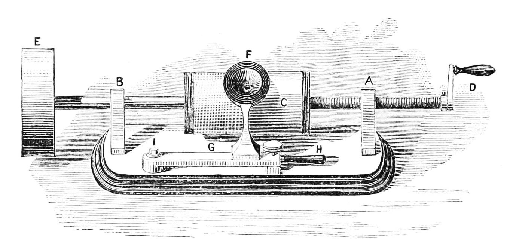

TURNTABLE
=====================================================================================================



vinyl is a workflow platform for multi-processsing a collection[list] of stencil.record objects.


```
import pandas as pd
import turntable

df = pd.DataFrame({'Artist':"""Michael Jackson, Pink Floyd, Whitney Houston, Meat Loaf, Eagles, Fleetwood Mac, Bee Gees, AC/DC""".split(', '),
              'Album' :"""Thriller, The Dark Side of the Moon, The Bodyguard, Bat Out of Hell, Their Greatest Hits (1971–1975), Rumours, Saturday Night Fever, Back in Black""".split(', ')})

collection = turntable.press.build_collection(df, my_favorite_record = 'nevermind')

record = collection[0]
print record.series

def set_cost(record):
    record.cost = 40
    return record

collection = turntable.spin.batch(collection, set_cost)

record = collection[1]
print record.series
```

http://semver.org/